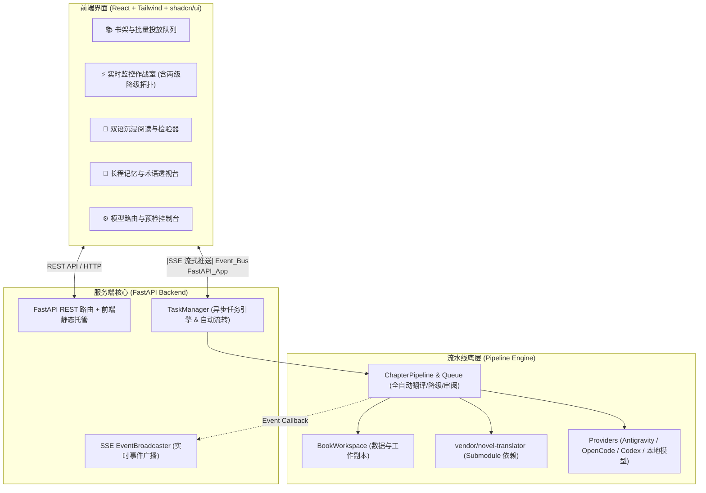

# Novel Translator Studio (Web & Desktop) - PRD & 技术规范说明书

## 1. 产品定位与目标 (Product Vision & Goals)

**Novel Translator Studio** 是一款面向个人读者与自建服务用户的**全自动 AI 小说翻译与重构工作台**。核心理念是 **“Drop & Read”（投放即读）** —— 借助多大模型协同架构（主译 + 二分降级容灾救回 + 章节长程记忆与审阅自动写回 + 横排版式重构），实现从原始日文 EPUB 到高质量中文 EPUB 的全自动交付。

### 1.1 核心用户与典型场景
1. **家庭服务器 / NAS 挂机自建用户 (Self-hosters / Homelab)**：
   - 部署在内网 Linux / NAS (Docker) 上，支持 24/7 批量处理投放的小说；
   - 手机/平板/电脑随时在内网打开 Web 查看进度、阅读与下载成品 EPUB。
2. **个人读者 / 极简桌面用户 (Desktop / Portable Users)**：
   - 一键启动（便携包或桌面客户端）；
   - 可视化配置 API Key 或本地模型（LM Studio / Ollama），拖入 EPUB 即可一键全自动翻译。

> [!NOTE]
> **产品设计哲学**：在 AI 时代彻底告别繁复的多人协同与人工校对流程，由 AI 审阅器（`ChapterReviewer`）全自动完成事实一致性校验与缺陷修正；界面聚焦于**全自动流水线透明监控、双语沉浸式阅读检验、全书长程记忆透视与多模型路由管理**。

---

## 2. 系统整体架构与技术选型 (Architecture & Tech Stack)



### 2.1 技术栈选型

| 层次 | 技术选型 | 说明 |
| :--- | :--- | :--- |
| **前端框架** | **React 18/19 + Vite + TypeScript** | 极速响应，组件生态丰富 |
| **UI 库** | **Tailwind CSS + shadcn/ui + Lucide Icons** | 现代化暗色/明亮质感，自包含无冗余 |
| **状态与数据** | **TanStack Query (v5) + Zustand** | 异步缓存、轮询与局部状态解耦 |
| **双语阅读器** | **@tanstack/react-virtual** | 虚拟滚动长列表，流畅承载超大长章节 |
| **后端框架** | **FastAPI + Pydantic v2** | 纯 Python 3.11+ 异步高性能框架 |
| **实时推送** | **Server-Sent Events (SSE)** | `sse-starlette`，比 WebSocket 更轻量防断线 |
| **依赖集成** | **Git Submodule (`vendor/novel-translator`)** | 内置 Fork 增强版，免去外部多仓库配置烦恼 |
| **交付形态** | **Docker 镜像 + Local CLI (`start_web.py`)** | 单一 Docker 镜像与一键脚本通吃所有环境 |

---

## 3. 核心功能模块规范 (Feature Specifications)

### 3.1 模块 1：书架与批量队列 (Library & Queue Dashboard)
*   **EPUB 拖拽上传**：拖入任意 EPUB 文件，后台自动解包、读取封面与元数据并建立工作区。
*   **书籍状态卡片**：
    *   状态指示：`排队中 (Pending)`、`全自动处理中 (In Progress: 68%)`、`已完成 (Completed)`、`异常挂起 (Error)`。
    *   统计指标：章节进度、原文字数、译文字数、救回段落数、处理耗时。
*   **一键操作**：
    *   【开始/继续翻译】、【暂停任务】。
    *   【一键下载 EPUB】：默认自动横排重构（`Horizontal`），亦可选择保持原版（`Preserve`）。
    *   【一键重新生成 EPUB】/【清理书籍工作区】。

### 3.2 模块 2：实时翻译作战室 (Live Translation Studio)
*   **两级降级容灾流向拓扑 (Fallback Topology)**：
    *   动态展示段落遭遇审查拦截时的自动降级回路：
      $$\text{Primary (Gemini)} \xrightarrow{\text{敏感拦截}} \text{二分递归拆解} \xrightarrow{\text{仍受阻}} \text{Fallback \#1 (OpenCode)} \xrightarrow{} \text{Fallback \#2 (本地无审查模型)}$$
    *   直观呈现各级救回数量与拦截原因分布。
*   **实时段落瀑布流 (Live Stream)**：
    *   段落级动态呈现：`章节 -> 段落 -> 原文 -> 译文 -> 命中模型 -> 耗时`。
*   **运行指标大屏**：
    *   当前 TPS、平均延迟、累计 Token 估算与实时诊断日志。

### 3.3 模块 3：双语沉浸阅读与检验器 (Bilingual Reader & Inspector)
*   **左右分栏 / 逐段双语对照视图**：
    *   左侧原文，右侧译文，支持目录树快速跳转。
    *   段落来源标签：`[主译: Antigravity]`、`[救回: OpenCode]`、`[救回: LM Studio]`、`[AI 审阅修复]`。
*   **轻量行内微调 (可选)**：
    *   阅读时若发现想微调的词句，双击即可修改并自动原子写回 `manifest.json`。
*   **AI 审阅修复报告查阅**：
    *   展示该章 Reviewer 自动识别并修复的问题清单（误译修正、主客体理顺、术语统一等），一目了然 AI 做了哪些优化。

### 3.4 模块 4：长程记忆与术语透视台 (Memory & Knowledge Hub)
*   **术语表 (Glossary) 透视**：
    *   查看全书动态沉淀的专有名词（人名、地名、技能、组织）。
    *   支持手动补充自定义术语（将在后续章节翻译中自动生效）。
*   **全书长程记忆 (Book Memory)**：
    *   卡片式浏览：登场角色设定、阵营关系与核心世界观脉络。
*   **章节演进大纲 (Chapter States)**：
    *   按时间轴浏览每一章由 AI 自动提炼的剧情概要。

### 3.5 模块 5：模型路由与系统控制台 (Provider & Settings Console)
*   **角色路由绑定**：
    *   主译模型（Primary）、备用降级链（Fallback 1/2）、审阅模型（Reviewer）下拉自由切换。
*   **Provider 配置与一键预检 (Preflight)**：
    *   可视化配置 API Key、Base URL 或本地模型端口。
    *   **【一键连通性预检】**：即时测试全部 Provider 的连通性与网络延迟。
*   **流水线策略设置**：
    *   单批字符上限、二分递归深度、默认导出版式等。

---

## 4. 后端 API 规范 (REST & SSE Contracts)

### 4.1 REST API 核心接口

```text
# 书籍与文件
POST   /api/v1/books/upload             # 上传 EPUB，自动初始化工作区
GET    /api/v1/books                    # 获取书籍列表与进度状态
GET    /api/v1/books/{id}               # 获取书籍详细信息
GET    /api/v1/books/{id}/chapters      # 获取章节目录
GET    /api/v1/books/{id}/chapters/{cid}# 获取章节段落 (含双语及来源)
PUT    /api/v1/books/{id}/paragraphs/{pid} # 可选微调单段译文
POST   /api/v1/books/{id}/export        # 导出 EPUB (layout: horizontal/preserve)
GET    /api/v1/books/{id}/download      # 下载最终成品 EPUB

# 流水线与任务调度
POST   /api/v1/tasks/pipeline/start     # 启动全自动流水线
POST   /api/v1/tasks/pipeline/pause     # 暂停
POST   /api/v1/tasks/pipeline/resume    # 继续
POST   /api/v1/tasks/pipeline/stop      # 停止
POST   /api/v1/tasks/retranslate-paragraph # 单段即时重新翻译

# 记忆库与审阅透视
GET    /api/v1/books/{id}/glossary      # 获取术语表
POST   /api/v1/books/{id}/glossary      # 补充自定义术语
GET    /api/v1/books/{id}/memory        # 获取 Book Memory 与 Chapter States
GET    /api/v1/books/{id}/reviews/{cid} # 查看 AI 审阅结果与自动修复记录

# 系统配置与预检
GET    /api/v1/config                   # 读取 config.toml
POST   /api/v1/config                   # 保存配置
POST   /api/v1/system/preflight         # 执行 Provider 连通性与延迟预检
```

### 4.2 SSE 实时事件流 (`GET /api/v1/events/stream`)

*   `pipeline_progress`：章节流转、全书进度、当前批次。
*   `paragraph_translated`：单段翻译完毕（原文、译文、耗时、所用模型）。
*   `fallback_triggered`：触发降级救回（拦截原因、目标救回模型）。
*   `review_completed`：单章审阅与长程记忆提取完成，自动修复条数。

---

## 5. Git Submodule 依赖收敛规范

将本地包含修复的 `novel-translator` 作为子模块内嵌：
1. 路径为 `vendor/novel-translator`；
2. `translator/core/novel_tool.py` 优先读取 `vendor/novel-translator`；
3. 用户使用 `git clone --recursive` 或 Docker 启动，零额外配置。

