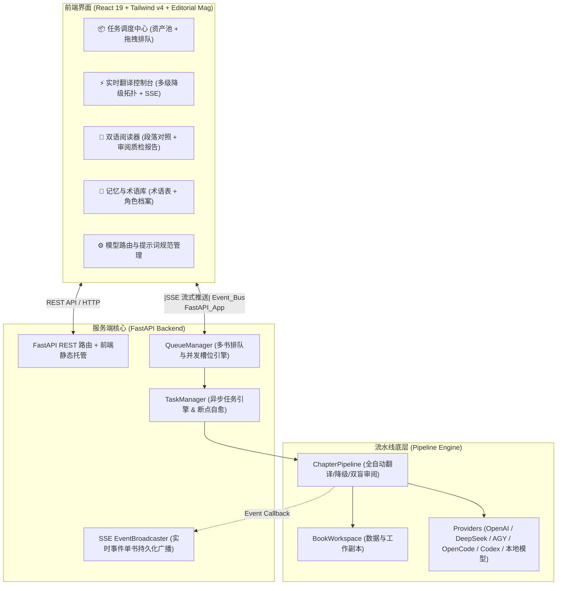

# Novel Translator Studio (Web & Desktop) - PRD & 技术规范说明书

## 1. 产品定位与目标 (Product Vision & Goals)

**Novel Translator Studio** 是一款面向个人读者与自建服务用户的**全自动 AI 小说翻译、双盲一致性审阅与重构出版工作台**。核心理念是 **“Drop & Read”（投放即读）** —— 借助多大模型协同架构（主译 + 二分降级容灾救回 + 章节长程记忆与审阅自动写回 + 横排版式重构），实现从原始日文 EPUB 到高质量中文 EPUB 的全自动交付。

### 1.1 核心用户与典型场景
1. **家庭服务器 / NAS 挂机自建用户 (Self-hosters / Homelab)**：
   - 部署在内网 Linux / NAS (Docker) 上，支持 24/7 批量处理投放的小说；
   - 手机/平板/电脑随时在内网打开 Web 查看进度、阅读与下载成品 EPUB。
2. **个人读者 / 极简桌面用户 (Desktop / Portable Users)**：
   - 一键启动（便携包或桌面客户端）；
   - 可视化配置 API Key 或本地模型（LM Studio / Ollama），拖入 EPUB 即可一键全自动翻译。

> [!NOTE]
> **产品设计哲学**：由 AI 审阅器（`ChapterReviewer`）全自动完成事实一致性校验与缺陷修正；界面聚焦于**全自动流水线透明监控、双语沉浸式阅读检验、全书长程记忆透视与多模型路由管理**，并以 **独立出版杂志 (Editorial Mag)** 范式提供书籍装帧级别的视觉美感与排版质感。

---

## 2. 视觉范式：独立出版杂志 (Editorial Mag)

Studio 采用考究高雅的独立出版杂志风格，消除常规 AI 仪表盘的暗黑荧光压迫感：
- **纸张与墨水基底**：温暖精致的出版暖白瓷纸底色（`#FAF9F6`），搭配深邃墨水黑（`#1A1A1A`）与碳素石墨灰（`#4A4A4A`）。
- **典雅排版与字体**：标题全面引入 `Noto Serif SC` / `Zen Old Mincho` 经典衬线书体；正文使用开阔通透的 `Inter`；版次、Token 统计与代码使用精准克制的 `Space Grotesk` / `Fira Code` 等宽字体。
- **出版印章与宝蓝点缀**：沉稳深邃的皇家宝蓝（`#1D4ED8`）按键与焦点，辅以 `EDITION · 2026` 独立出版印章与 `#1` `#2` 印刷序号标。

---

## 3. 系统整体架构 (System Architecture)

---

## 4. 核心功能模块规范 (Feature Specifications)

### 4.1 模块 1：任务调度中心 (Queue & Asset Hub)
*   **已注册书籍资产池 (Book Pool)**：
    *   展示所有已导入的书籍卡片，包含章节数、已翻译段落数、进度条及排队状态。
    *   提供快捷操作：一键加入队列、阅读、重置记忆、导出 EPUB 与彻底删除。
*   **执行调度队列 (Execution Queue)**：
    *   支持原生鼠标拖拽抓手（`⠿`）自由调整待命书籍次序，辅助提供置顶、上移、下移快捷键。
    *   **动态并发槽位 (Concurrency)**：支持 1~4 本并行处理控制。
    *   **待命暂停与启动**：书籍加入队列后处于待命暂停状态，支持调序完成后手动一键「启动队列」。
*   **异常记录与一键重试**：
    *   展示翻译中断或失败的书籍记录与具体错误原因，支持一键「重试」自动重新入队。

### 4.2 模块 2：实时翻译控制台 (Live Translation Studio)
*   **两级降级容灾流向拓扑 (Fallback Topology)**：
    *   动态展示段落遭遇审查拦截时的自动降级回路：
      $$\text{Primary (Nemotron / Gemini)} \xrightarrow{\text{敏感拦截}} \text{二分递归拆解} \xrightarrow{\text{仍受阻}} \text{Fallback \#1 (Gemini Lite)} \xrightarrow{} \text{Fallback \#2 (DeepSeek / 本地模型)}$$
    *   直观呈现各级救回数量与拦截原因分布。
*   **动态 Policy 规范切换**：
    *   支持为当前任务指定不同的翻译提示词策略文档（如情色小说规范、通用小说规范、轻小说规范等）。
*   **单书独立 SSE 实时事件瀑布流**：
    *   全量推送章节启动、批次完成、全书进度、降级触发与审阅修复事件；单书独立持久化历史记录，切换页面不丢失，支持分类过滤与手动一键清空。

### 4.3 模块 3：双语阅读器与检验器 (Bilingual Reader & Inspector)
*   **目录索引 (TOC)**：清晰展示全书章节列表与完成状态指示。
*   **段落级精细对照**：上方日文原文衬线排版，下方中文译文纸面排版；清晰标注段落 ID、翻译 Provider 与容灾救回来源。
*   **人工原地校对与单段重译**：支持直接在阅读器中点击「编辑」修改译文并即刻写回工作区；支持单段点击「重译」重新调用主译模型。
*   **章节质检审阅报告**：折叠面板展示本章一致性审阅报告、长程叙事摘要及所有修正缺陷清单（包含修正原因、被替换内容与新译文）。

### 4.4 模块 4：记忆与术语库 (Knowledge Hub)
*   **动态沉淀术语表 (Glossary)**：展示由审阅模型在章节推进时自动提取并合并的专有名词、统一译名、置信度与出现章节，支持手动添加自定义术语。
*   **角色长程档案 (Characters)**：提取全书人物名称、别名、角色定位与人物画像。
*   **世界观设定 (World Settings)**：沉淀作品独特的技能、道具、势力与世界观解释。
*   **全书质检审计报告 (Audit Reports)**：汇总各章节审阅发现的客观问题数与修复写回明细。

### 4.5 模块 5：模型路由与提示词规范管理 (Settings & Prompt Manager)
*   **AI Provider 可视化管理器**：直观配置与增删 OpenAI 兼容接口（DeepSeek、SiliconFlow、OpenRouter、LM Studio、Ollama 等）、Antigravity CLI、OpenCode CLI 与 Codex CLI。
*   **一键并发连通性测试 (Preflight Probe)**：并发探测所有已配置模型的网络可达性、API 鉴权与往返延迟（ms）。
*   **提示词规范管理器 (Prompt Policy Manager)**：在线查看、新建、编辑与保存 Markdown 翻译规范及审阅规范，支持一键「设为系统全局默认规范」。

---

## 5. API 路由规范 (REST & SSE Endpoints)

| 路由路径 | 方法 | 描述 |
| :--- | :---: | :--- |
| `/api/v1/books` | GET / POST | 获取已注册书籍列表 / 上传并解析新 EPUB/TXT |
| `/api/v1/books/{id}` | GET / DELETE | 获取书籍详情 / 彻底删除书籍 |
| `/api/v1/books/{id}/reset` | POST | 重置书籍翻译进度与长程记忆 |
| `/api/v1/books/{id}/export` | POST | 导出排版后的中文 EPUB |
| `/api/v1/queue` | GET | 获取当前任务队列状态与各项明细 |
| `/api/v1/queue/enqueue` | POST | 批量将书籍加入队列 |
| `/api/v1/queue/reorder` | POST | 拖拽后重新对队列项排序 |
| `/api/v1/queue/pause` | POST | 暂停任务调度（处于待命状态） |
| `/api/v1/queue/resume` | POST | 启动任务调度 |
| `/api/v1/tasks/start` | POST | 启动指定书籍的流水线任务 |
| `/api/v1/tasks/status/{id}` | GET | 查询指定书籍的后台流水线状态 |
| `/api/v1/events/stream` | GET (SSE) | 订阅流水线实时流式事件推送 |
| `/api/v1/knowledge/{id}/glossary` | GET / PUT | 查询 / 更新书籍术语表 |
| `/api/v1/system/config` | GET / POST | 读取 / 保存系统全局 `config.toml` 配置 |
| `/api/v1/system/preflight` | POST | 执行所有 Provider 并发连通性测试 |
| `/api/v1/system/prompts` | GET / POST | 查询 / 保存提示词规范文件 |
